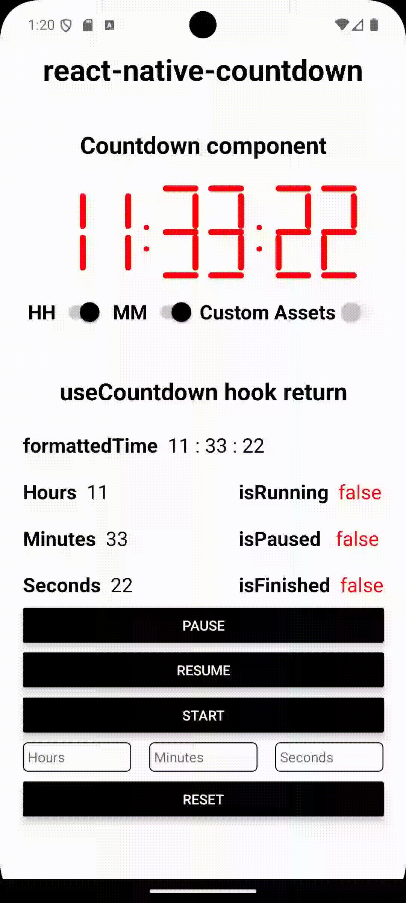

## rn-countdown-manager

Manage countdowns and get a cool visual component!

<p align="center">
  
</p>

## Installation

Currently, the lib is still under development :disappointed:

## Usage

1. `useCountdown` hook - manages all time props and methods

```jsx
import { useCountdown } from 'rn-countdown-manager';

const {
  isRunning, // hook is still running
  isPaused, // hook is paused
  isFinished, // hook is finished
  pause, // pauses the hook
  resume, // resume the hook if is paused
  start, // start hook if autoStart prop is false
  reset, // reset the hook passing a new hour, minute and second
  formattedTime, // time formatted as HH:MM:SS
  hours, // current hours
  minutes, // curent minutes
  seconds, // current seconds
} = useCountdown({
  autoStart: false, // tells if hook stats on mount
  hours: 1, // starting hours (Max to 99)
  minutes: 2, // starting minutes (Max to 59)
  seconds: 3, // starting seconds (Max to 59)
  onComplete: () => console.log('Finished!'), // callback when hook finishes
});
```

2. `Countdown` component - purely visual component, based on a 7-segment display

```jsx
import { Countdown } from 'rn-countdown-manager';

<Countdown
  hours={hours} // hours on component (Max to 99)
  seconds={seconds} // minutes on component (Max to 59)
  minutes={minutes} // seconds on component (Max to 59)
  showHours={true} // if hours digits should be shown
  showMinutes={true} // if minutes digits should be shown
  color="black" // cell color when on (defaults to #000000)
  offColor="green" // cell color when off (defaults to transparent)
  size="md" // component size, can be "sm", "md" or "lg"
  customBlocks={customBlockAssetsJson} // custom SVGs can be used in cells
  CustomSeparator={() => <Text> - </Text>} // custom separator for HH:MM:SS, accepts any React.FC
/>;
```

3. Helper types - types to help implementation

```jsx
import {
  CustomBlocksType, // component custom assets
  ZERO_TO_FIFTY_NINE, // used on minutes and seconds
  ZERO_TO_NINETY_NINE, // used on hours
  UseCountdownProps, // timer hook props
  UseCountdownReturn, // timer hook return
} from 'rn-countdown';
```

There is also an [example](https://github.com/thiago-cmont/rn-countdown-manager/tree/develop/example) to test all features!

<p align="center">
  
</p>

## Upcoming features

- Add storybook/playground;
